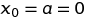
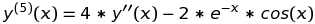
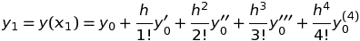
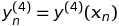

# Лабораторная работа № 7. Дифференциальные уравнения. Задача Коши.

Выполнил студент группы     
Гурьянов Максим Олегович  

## Вариант № 11
Решить методом Тейлора 4-го порядка задачу Коши 
 
, 
,   
 
с заданной относительной точностью  
Требуется построение графиков решения , а также фазовых траекторий. За своевременное выполнение 
задания начисляется **6 баллов**. 
Дополнительные **3 балла** будут начислены, если будет найдено точное решение и оно будет сопоставлено 
(построены соответствующие разностные графики) с полученным приближенным решением. 
Еще **3 балла** будут начислены, если решение задачи Коши будет найдено с помощью встроенных функций и 
оно также будет сопоставлено (построены соответствующие разностные графики) с исходным приближенным 
решением.  
## Теоретическая часть
Уравнение   
, ,  
связывающее неизвестную функцию , независимую переменную  и производные 
 неизвестной ф-ции, называется *обыкновееным дифференциальным уравнением*. 
*Порядком* дифференциального уравнения называется порядок старшей производной в нем. 
В *задаче Коши* для дифференциального уравнения *n*-го порядка искомая ф-ция *y(x)*, кроме самого 
диффер-го ур-я должна удовлетворять заданным начальным условиям: 
, 
, 
, 
. 
 
При численном решении *задачи Коши* ищется последовательность векторов , являющихся приближениями 
для значений решения  на множестве точек сетки   
,   
где  - шаг сетки. Мы используем метод с равномерной сеткой, т.е. сеткой с постоянным шагом . 
Основное предположение, которое мы принимаем, состоит в непрерывности дифференцируемых ф-ций. 
 
***Суть метода разложения в ряд Тейлора:*** 
Простейшим способом построения приближенного решения в точке  
сетки  является способ, основанный на разложении решения в ряд
Тейлора в предыдущей точке сетки  по степеням шага  :  
  , 
 
Вместо этого ряда можно взять конечный его отрезок. 
Т.к по условию порядок формулы Тейлора = 4, то значение ф-ции в каждой точке координатной 
сетки будет выражаться следующим образом:  
 *(1)* 
Продифференцируем ее 2 раза относительно *x*: 
 *(2)* 
 *(3)* 
 
**Алгоритм:** 
Выбираем начальный шаг  Например, . 
Нам известно значение ф-ции и первых 2-х ее производных в начальной точке : 
, ,  
А значения оставшихся производных в этой точке можно найти. 
Запишем нашу ф-цию в виде:  
 *(4)* 
И найдем выражения для 4-6 производных, продифференцировав *(4)*: 
 *(5)* 
 *(6)* 
 *(7)* 
 
Находим по ф-лам (4), (5), (6), (7): 
, 
, 
, 
 
Теперь т.к нам известны значения всех производных, можем вычислить значение в точке *x1 = x0 + h* по формуле (1): 
  
 
Теперь найдем по ф-лам (2) - (7) 
, 
, 
, 
, 
, 
, 
 
т.к нам известны значения всех производных, можем вычислить значение в точке *x2 = x1 + h* по формуле (1): 
  
    
 
Находим по ф-лам (2) - (7) 
,  
, 
, 
, 
, 
,   

т.к нам известны значения всех производных, можем вычислить значение в точке  по формуле (1). 
Находим все значения ф-ции в точках сетки до тех пор, пока  не будет равно . 
  

Уменьшаем шаг: делим его пополам или на любое другое число и повторяем алгоритм 
Проверяем условие останова: , где *e* - заданная нами точность,  - найденное значение в точке
*x=b* на предыдущем шаге ,  - найденное значение в точке *x=b* на текущем шаге. 
Если условие выполняется, алгоритм заканчивает работу. И  решением является последнее найденное приближение. Иначе, снова уменьшаем 
шаг и повторем алгоритм заново. 
 
Т.к шаг *h -> 0* , значения производной будем вычислять по формуле   
## Практическая часть
Моя работа состоит из 2-х программ:  
1) Программа с реализацией поиска значений ф-ций *y(x)*, *y'(x)*, *y'(y)* написанная на языке C++ 
2) Программа для отрисовки ф-ций, написанная на Python  

Программа на C++ состоит из 1-го файла **`lab7.cpp`**  

Структура программы: 
* В начале программы продключаются библиотеки:  
     `iostream` - стандартная библиотека ввода/вывода 
     `cmath` - стандартная библиотека для выполнения математических операций  
     `fstream` - библиотека для чтения/записи данных из/в файл  
* `long double dy3_(double x)` - функция ,зависящая от переменной *x* и выражающая 3-ю производную. 
* `long double dy4_(double x)` - функция , выражающая 4-ю производную. (получена диффер-ем по *x* ф-ции `dy3_(x)`) 
* `long double dy5_(double x)` - функция , выражающая 5-ю производную. (получена диффер-ем ф-ции `dy4_(x)`) 
* `long double dy6_(double x)` - функция , выражающая 6-ю производную. (получена диффер-ем ф-ции `dy5_(x)`) 
* `long double Teilor()` - разложение в ряд Тейлора (с ее помощью находим значние ф-ции в следующей точке при помощи значения в предыдущей) 
* `long double T1()` - функция , выражающая 1-ю производную. (получена диффер-ем ф-ции `Teilor()`) 
* `long double T2()` - функция , выражающая 2-ю производную. (получена диффер-ем ф-ции `T1()`) 
* `int fact(int x)` - функция, вычисляющая факториал *x* 
* `long double dy[7]` - массив значений производных от 0 порядка (самой ф-ции) до 6 включильно 
* `long double a = 0, b = 2` - отрезок дифференцирования по оси *OX* 
* `long double h =(b-a)/2` - начальный шаг по оси *OX* 
* `double e = 0.01` - точность, с которой нужно найти решение 
 

* В методе `int main()` происходит вычисление значений ф-ции и ее производной с последующей записью их в файл .  
В файл `Func.txt` записываются значения *x* и *y(x)*,  в `Proizv.txt` - значения *x* и производной *y'(x)*, в `FazTraekt.txt` - значения *y(x)* и *y'(x)*.  

Программа на Python состоит из 1-го файла **`graph.py`** 

В ней строятся графики **y(x)** , **y'(x)**, **y'(y)** по данным из файлов `Func.txt`, `Proizv.txt` и `FazTraekt.txt` соответственно.  

**Порядок компилляции/запуска:** 
1. Компиллируем и запускаем файл **`lab7.cpp`** из командной строки при помощи команды: 
`g++ lab7.cpp -o lab7.o`  
2. Запускаем из командной строки `lab7.o`  
2. Запускаем файл **`graph.py`** в программе Spyder (или другой, поддерживающей язык Python) 
### Результаты
В результате работы программы были найдены значения  **y(x)** , **y'(x)** с точностью **e = 0.01** и построены графики этих функций. Также построен график фазовой траектории **y'(y)**. 
Ниже приведен рисунок с изображением функций. 

